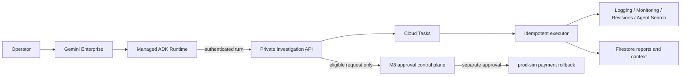

# OpsPilot

[English](README.md) | **한국어**

**Google Cloud와 Gemini Enterprise를 위한 증거 기반 AI Incident Commander**

OpsPilot은 합성 전자상거래 환경의 장애를 한정된 Google Cloud 증거로 조사하고, 인용된
모든 주장을 검증하며, 조사 권한과 복구 권한을 분리하는 에이전트입니다. 얇은 관리형
ADK Runtime과 권위 있는 FastAPI 조사 서비스를 기반으로 비공개 Gemini Enterprise
에이전트로 배포되어 있습니다.

## 검증된 릴리스

상태: **formal agent 배포 및 Gemini Enterprise Preview QA 검증 완료**

| 게이트 | 결과 |
| --- | --- |
| Python 테스트 | 289/289 |
| Core agent 평가 | 7/7 |
| Portfolio 평가 | 40/40 |
| Remediation 평가 | 12/12 |
| Terraform 테스트 | bootstrap 1/1, environment 10/10 |
| Runtime 패키징 | 11개 파일 archive 2회 byte-identical |
| 최종 인프라 계획 | `No changes` |

현재 기준 기록은 개인정보와 클라우드 식별자를 제거한
[Preview 양성 장애 검증](docs/portfolio/results/long-spec-formal-agent-v3.md)이며,
동일 결과의 [JSON 기록](docs/portfolio/results/long-spec-formal-agent-v3.json)도 제공합니다.
이전 릴리스와 QA 결과는 감사 이력으로 [검증 증빙 색인](docs/portfolio/results/README.ko.md)에
보존합니다.
선택형 예약 데모 확장은 별도의
[예약 장애 체험 검증 기록](docs/portfolio/results/long-spec-scheduled-experience-v1.md)으로 확인할 수 있습니다.

## 에이전트가 지원하는 범위

- `order-service`, `payment-service`, `inventory-service`의 개별 또는 복수 서비스 조사
- 합성 환경 `dev`, `staging`, `prod-sim`; 실제 production 요청은 명시적으로 거절
- 한국어·영어 별칭, 상대·절대 1~120분 구간, 6개 증상 분류, QUICK/STANDARD/DEEP 조사 깊이
- 신규 조사, 범위 조정, 보고서 요약 설명, 상태 조회, 보고서 버전 비교, 기능 안내,
  제한된 remediation 요청 intent
- 원문 질문, 사용자·세션 ID, evidence 본문을 저장하지 않는 가명화된 24시간 대화 문맥
- 서버 소유 allowlist와 query builder로 생성한 Logging, Monitoring, Cloud Run revision,
  Agent Search 증거
- 한국어 Gemini Enterprise 빠른 시작 프롬프트 칩과 30분마다 요청 단위로 실행되는
  `dev payment-service` SCN-001 펄스. 최근 60분을 조사하면 별도 장애 준비 없이 실제 합성
  탐지 흐름을 체험할 수 있습니다.

최종 Gemini Enterprise Preview 검수에서는 통제된 합성 payment 장애를 발생시킨 뒤,
한정된 metric 수집이 완료될 때까지 안전하게 기다리고 `SEV-2 / IDENTIFIED` 보고서를
생성했습니다. 보고서에는 검증된 connection-pool H-01, support가 0인 대안 H-02,
3개 evidence 유형, 유효한 citation과 승인 필수 containment·mitigation·root-fix 권고가
포함됐습니다. 조사 종료 전 workload가 정상 baseline으로 복구된 것도 확인했습니다.

## 아키텍처와 신뢰 경계



Runtime은 investigation bridge만 호출할 수 있습니다. Evidence 조회, 영속화, task 실행,
승인과 rollback은 서로 분리된 identity가 담당합니다. Rollback 요청은 적격한
`prod-sim payment-service` 보고서에 대해서만 만들 수 있으며, 에이전트는 이를 승인하거나
실행할 수 없습니다. 전체 영속 실행에서 trace, correlation, idempotency, redaction과
citation 무결성을 강제합니다.

## 빠른 시작

필요 환경은 Python 3.12, [uv](https://docs.astral.sh/uv/), 로컬 workload용 Docker,
인프라 검증용 Terraform 1.15입니다.

```powershell
uv sync --frozen --extra agent
uv run opspilot replay --scenario SCN-001 --format markdown
uv run --extra agent opspilot agent run --scenario SCN-001 --format summary
uv run opspilot serve
```

전체 로컬 합성 workload 실행:

```powershell
docker build --platform linux/amd64 -t opspilot-demo:local .
docker compose up -d --no-build
docker compose exec -T -e OPSPILOT_ORDER_URL=http://127.0.0.1:8080 order `
  opspilot scenario run --scenario SCN-001 --auth local --format summary
docker compose down --remove-orphans
```

SCN-001은 `5/5 baseline -> 4 fulfilled / 6 failed incident -> 5/5 recovery`로 제한된
시퀀스를 생성합니다. 모든 데이터와 workload는 합성 환경 전용입니다.

## 검증 명령

```powershell
uv run ruff format --check .
uv run ruff check .
uv run --extra agent mypy src tests
uv run --extra agent pytest
uv build
uv run --extra agent opspilot agent eval --suite core --format summary
uv run --extra agent opspilot agent eval --suite portfolio --format summary
uv run opspilot remediation eval --suite remediation --format summary
terraform fmt -check -recursive infra/terraform
terraform -chdir=infra/terraform/bootstrap validate
terraform -chdir=infra/terraform/bootstrap test
terraform -chdir=infra/terraform/environments/dev validate
terraform -chdir=infra/terraform/environments/dev test
```

GitHub workflow는 수동 실행 전용입니다. Hosted Runner에는 외부 billing 또는 spending-limit
문제가 남아 있어 source-bound 로컬 및 관리형 환경 게이트가 현재의 권위 있는 릴리스
증거입니다. 오해를 부를 수 있는 CI badge는 표시하지 않습니다.

## 문서

| 주제 | 문서 |
| --- | --- |
| 앱 정보 | [관리자용 앱 안내](docs/guides/app-overview.ko.md) |
| 처음 이용하기 | [체험자 가이드](docs/guides/first-time-user.ko.md) |
| 가이드·원본 기획서 묶음 | [ZIP 압축 파일](opspilot-guides.zip) |
| 시스템 설계 | [아키텍처](docs/portfolio/architecture.ko.md) |
| 품질 게이트 | [평가](docs/portfolio/evaluation.ko.md) |
| 재현 가능한 데모 | [데모](docs/portfolio/demo.ko.md) |
| 요구사항 충족 상태 | [요구사항 추적표](docs/requirements-traceability.ko.md) |
| Runtime 운영 | [Agent Runtime runbook](docs/operations/agent-runtime.ko.md) |
| 정식 배포 | [Formal agent rollout](docs/operations/formal-agent-rollout.ko.md) |
| 예약 장애 체험 | [합성 장애 시나리오](docs/operations/scenarios.ko.md) |
| 복구 경계 | [Remediation runbook](docs/operations/remediation.ko.md) |
| 보안 | [위협 모델](docs/security/threat-model.ko.md), [IAM 매트릭스](docs/iam-matrix.ko.md) |
| 비용 통제 | [비용 guardrail](docs/cost-model.ko.md) |
| 현재 상태 | [프로젝트 상태](docs/plans/current.ko.md) |
| 검증 이력 | [증빙 색인](docs/portfolio/results/README.ko.md) |

## 의도적으로 지원하지 않는 범위

OpsPilot은 실제 production에 연결하거나, 임의의 cloud 질의·project·URL·filter를 받거나,
범용 쓰기 작업·자동 승인·자동 rollback을 수행하지 않습니다. BigQuery, 공개
simulation/live 전환, 전용 승인 UI, managed memory, multi-project/A2A/MCP, VPC Service
Controls, Model Armor, dashboard와 본격적인 부하·cold-start 시험은 현재 구현된 것처럼
과장하지 않고 향후 범위로 남겨 둡니다.

## 라이선스

[MIT License](LICENSE)를 적용합니다.
