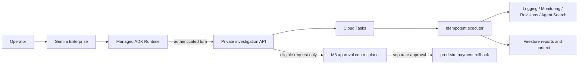

# OpsPilot

**English** | [한국어](README.ko.md)

**Evidence-grounded AI Incident Commander for Google Cloud and Gemini Enterprise**

OpsPilot investigates synthetic ecommerce incidents with bounded Google Cloud evidence, verifies
every cited claim, and keeps investigation separate from remediation authority. It is deployed as
a private Gemini Enterprise agent backed by a thin managed ADK Runtime and an authoritative
FastAPI investigation service.

## Verified release

Status: **formal agent deployed and Gemini Enterprise Preview QA verified**

| Gate | Result |
| --- | --- |
| Python tests | 289/289 |
| Core agent evaluation | 7/7 |
| Portfolio evaluation | 40/40 |
| Remediation evaluation | 12/12 |
| Terraform tests | bootstrap 1/1, environment 10/10 |
| Runtime packaging | two byte-identical 11-file archives |
| Final infrastructure plan | `No changes` |

The current source of record is the sanitized
[positive incident Preview verification](docs/portfolio/results/long-spec-formal-agent-v3.md),
with a machine-readable [JSON companion](docs/portfolio/results/long-spec-formal-agent-v3.json).
Earlier release and QA records are retained in the
[evidence index](docs/portfolio/results/README.md) as an audit trail.
The optional scheduled-demo extension is verified separately in the
[scheduled incident experience record](docs/portfolio/results/long-spec-scheduled-experience-v1.md).

## What the agent supports

- `order-service`, `payment-service`, and `inventory-service`, individually or together.
- Synthetic `dev`, `staging`, and `prod-sim` environments; actual production is rejected.
- Korean and English aliases, relative or explicit 1-120 minute windows, six symptom classes,
  and QUICK/STANDARD/DEEP investigation depth.
- New investigations, scope refinement, concise report explanation, status, report-version
  comparison, capability guidance, and bounded remediation-request intent.
- Pseudonymous 24-hour conversation context without storing raw prompts, user/session IDs, or
  evidence bodies.
- Logging, Monitoring, Cloud Run revision, and Agent Search evidence selected through server-owned
  allowlists and query builders.
- A Korean Gemini Enterprise quick-start prompt chip and a request-scoped `dev payment-service`
  SCN-001 pulse every 30 minutes, so a 60-minute investigation can demonstrate live synthetic
  detection without manual incident preparation.

In the final Gemini Enterprise Preview pass, OpsPilot observed a controlled synthetic payment
failure, safely waited for bounded metric ingestion, and then returned `SEV-2 / IDENTIFIED` with a
verified connection-pool H-01, a zero-support alternative H-02, three evidence types, valid
citations, and approval-gated containment, mitigation, and root-fix recommendations. The workload
recovered to its healthy baseline before the investigation completed.

## Architecture and trust boundary



The Runtime can invoke only the investigation bridge. Evidence reads, persistence, task execution,
approval, and rollback use separate identities. A rollback request can be created only for an
eligible `prod-sim payment-service` report; the agent cannot approve or execute it. Trace,
correlation, idempotency, redaction, and citation integrity are enforced across the persisted run.

## Quick start

Requirements: Python 3.12, [uv](https://docs.astral.sh/uv/), Docker for the local workload, and
Terraform 1.15 for infrastructure validation.

```powershell
uv sync --frozen --extra agent
uv run opspilot replay --scenario SCN-001 --format markdown
uv run --extra agent opspilot agent run --scenario SCN-001 --format summary
uv run opspilot serve
```

Run the complete local synthetic workload:

```powershell
docker build --platform linux/amd64 -t opspilot-demo:local .
docker compose up -d --no-build
docker compose exec -T -e OPSPILOT_ORDER_URL=http://127.0.0.1:8080 order `
  opspilot scenario run --scenario SCN-001 --auth local --format summary
docker compose down --remove-orphans
```

SCN-001 produces a bounded `5/5 baseline -> 4 fulfilled / 6 failed incident -> 5/5 recovery`
sequence. All data and workloads are synthetic.

## Validation

```powershell
uv run ruff format --check .
uv run ruff check .
uv run --extra agent mypy src tests
uv run --extra agent pytest
uv build
uv run --extra agent opspilot agent eval --suite core --format summary
uv run --extra agent opspilot agent eval --suite portfolio --format summary
uv run opspilot remediation eval --suite remediation --format summary
terraform fmt -check -recursive infra/terraform
terraform -chdir=infra/terraform/bootstrap validate
terraform -chdir=infra/terraform/bootstrap test
terraform -chdir=infra/terraform/environments/dev validate
terraform -chdir=infra/terraform/environments/dev test
```

GitHub workflows are manual-only. Their hosted runner currently has an external billing or
spending-limit condition, so the source-bound local and managed-environment gates above remain the
authoritative release evidence. No misleading CI badge is displayed.

## Documentation

| Topic | Document |
| --- | --- |
| App information | [Administrator overview](docs/guides/app-overview.md) |
| First-time use | [Participant guide](docs/guides/first-time-user.md) |
| System design | [Architecture](docs/portfolio/architecture.md) |
| Quality gates | [Evaluation](docs/portfolio/evaluation.md) |
| Reproducible demo | [Demo](docs/portfolio/demo.md) |
| Requirements coverage | [Traceability matrix](docs/requirements-traceability.md) |
| Runtime operations | [Agent Runtime runbook](docs/operations/agent-runtime.md) |
| Formal rollout | [Formal agent rollout](docs/operations/formal-agent-rollout.md) |
| Scheduled incident experience | [Synthetic scenarios](docs/operations/scenarios.md) |
| Remediation boundary | [Remediation runbook](docs/operations/remediation.md) |
| Security | [Threat model](docs/security/threat-model.md) and [IAM matrix](docs/iam-matrix.md) |
| Cost controls | [Cost guardrails](docs/cost-model.md) |
| Current state | [Project state](docs/plans/current.md) |
| Verification history | [Evidence index](docs/portfolio/results/README.md) |

## Deliberate boundaries

OpsPilot does not connect to actual production, answer arbitrary cloud queries, accept arbitrary
projects/URLs/filters, perform generalized writes, auto-approve remediation, or auto-execute a
rollback. BigQuery, public simulation/live switching, a dedicated approval UI, managed memory,
multi-project/A2A/MCP, VPC Service Controls, Model Armor, dashboards, and full load/cold-start
suites remain future work rather than hidden claims.

## License

Released under the [MIT License](LICENSE).
