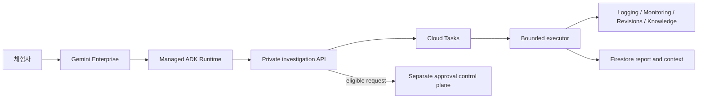

# OpsPilot 앱 정보

[English](app-overview.md) | **한국어**

상태: `formal_agent_verified`  
대상: 프로젝트 관리자, 검토자, 데모 진행자  
업데이트: 2026-08-15

## OpsPilot 소개

OpsPilot은 합성 Google Cloud 전자상거래 시스템을 위한 비공개 Gemini Enterprise Incident
Commander입니다. 제한된 운영 증거를 수집하고, 인용된 주장을 검증하며, 가능한 원인을
설명하고 승인 기반 조치를 권고합니다. 조사 권한과 복구 권한은 분리되어 있습니다.

| 항목 | 현재 계약 |
| --- | --- |
| 제공 방식 | 관리형 ADK Runtime 기반 비공개 Gemini Enterprise agent |
| 서비스 | `order-service`, `payment-service`, `inventory-service`의 개별 또는 복수 조사 |
| 환경 | 합성 `dev`, `staging`, `prod-sim` |
| 시간 범위 | 상대·명시적 1~120분 구간 |
| 언어 | 한국어·영어 입력 별칭과 보고서 표시 |
| 조사 깊이 | QUICK, STANDARD, DEEP |
| 증거 | Logging, Monitoring, Cloud Run revision, Agent Search knowledge |
| 대화 기능 | 신규 조사, 범위 조정, 설명, 상태, 버전 비교, 기능 안내 |
| 복구 | 적격한 `prod-sim payment-service` rollback 요청 생성만 가능; 승인과 실행은 별도 |
| 실제 production | 연결하지 않으며 명시적으로 거절 |

## 체험용 자동 장애

선택적으로 활성화한 전용 Cloud Run Job이 `Asia/Seoul` 기준 매시 5분과 35분에 합성
`dev payment-service`를 대상으로 요청 단위 SCN-001 트래픽을 생성합니다. 각 실행은
`5/5 baseline -> 4 fulfilled / 6 failed incident -> 5/5 recovery`를 만들고 자동으로 정상
상태로 돌아갑니다. 영구적인 장애 설정은 남지 않습니다.

Monitoring 수집 지연과 30분 실행 주기를 고려해 대표 체험 질의는 최근 60분을 사용합니다.

```text
dev payment-service 최근 60분 오류를 STANDARD로 분석해줘
```

한국어 `OpsPilot 빠른 시작` 프롬프트 칩에는 기능 안내, 단일 서비스, 전체 서비스, 1분 정상
상태 질의가 준비되어 있습니다. 장애 생성 자체는 모델 호출을 만들지 않으며, 사용자가
조사를 시작할 때만 모델 호출이 발생합니다.

## 이용 권한

모든 체험자는 본인의 조직 승인 Google 계정으로 로그인해야 합니다. 아이디, 비밀번호,
복구 코드, session cookie 또는 access token을 prompt, 문서, issue나 저장소에 공유하거나
업로드하지 마세요.

계정에는 다음 두 조건이 필요합니다.

1. 유효한 Gemini Enterprise 라이선스
2. 프로젝트 또는 OpsPilot 앱 수준의 Gemini Enterprise User
   (`roles/discoveryengine.agentspaceUser`)

OpsPilot만 체험한다면 app-level 권한을 권장합니다. 데모 편의를 위해 Project Owner,
Editor 같은 광범위한 관리자 권한을 추가하지 마세요. 자세한 내용은 Google의
[Gemini Enterprise 앱 접근 제어 안내](https://docs.cloud.google.com/gemini/enterprise/docs/iam-policy-for-apps)를 참고하세요.

## 아키텍처와 안전 경계



- Runtime은 investigation bridge만 호출할 수 있습니다.
- Evidence, task, persistence, Scheduler, remediation identity는 서로 분리합니다.
- 사용자와 세션 식별자는 domain-separated hash로만 저장합니다.
- 대화 문맥 TTL은 24시간이며 원문 prompt와 evidence 본문을 포함하지 않습니다.
- 명령, 임의 URL·project ID·IAM payload, 자동 승인과 자동 rollback은 agent 출력과 권한에서
  제외합니다.

## 관리자 권장 시연 순서

체험자 한 명당 15~20분을 권장합니다.

1. 계정으로 Gemini Enterprise를 열고 `OpsPilot Incident Commander`를 선택합니다.
2. 한국어 빠른 시작 칩을 보여주고 기능 안내 prompt를 실행합니다.
3. 최근 1분 정상 상태를 확인합니다.
4. 최근 60분 `dev payment-service` 장애를 조사합니다.
5. H-01/H-02, evidence citation, data gap과 세 권고 분류를 함께 확인합니다.
6. 같은 채팅에서 요약, 시간 범위 확대, H-02 심층 확인과 보고서 버전 비교를 요청합니다.
7. 실제 `prod` 요청이나 restart 명령처럼 의도적으로 막은 경계를 하나 보여줍니다.
8. 적격한 `prod-sim payment-service` 보고서가 준비된 경우 승인이나 실행 없이
   `WAITING_APPROVAL` 요청 생성까지만 보여줍니다.

## 현재 검증 기준선

- pytest 289/289, core 7/7, portfolio 40/40, remediation 12/12
- Terraform bootstrap 1/1, environment 10/10
- Runtime 재현 패키징과 최종 bootstrap/dev `No changes`
- 수동·예약 SCN-001 실행과 자동 복구
- Gemini Enterprise Preview 60분 양성 조사와 1분 정상 상태 검증

식별자를 제거한 최신 기록은 [scheduled incident experience v1](../portfolio/results/long-spec-scheduled-experience-v1.md)입니다.

## 관련 문서

- [처음 이용하기](first-time-user.ko.md)
- [아키텍처](../portfolio/architecture.ko.md)
- [IAM 매트릭스](../iam-matrix.ko.md)
- [합성 장애 시나리오 운영](../operations/scenarios.ko.md)
- [비용 guardrail](../cost-model.ko.md)
- [현재 프로젝트 상태](../plans/current.ko.md)
