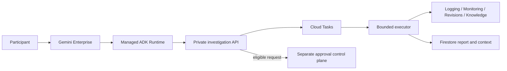

# OpsPilot App Information

**English** | [한국어](app-overview.ko.md)

Status: `formal_agent_verified`  
Audience: project administrators, reviewers, and demo facilitators  
Updated: 2026-08-15

## What OpsPilot is

OpsPilot is a private Gemini Enterprise Incident Commander for a synthetic Google Cloud ecommerce
system. It collects bounded operational evidence, verifies cited claims, explains likely causes,
and recommends approval-gated actions. Investigation and remediation authority remain separated.

| Item | Current contract |
| --- | --- |
| Delivery | Private Gemini Enterprise agent backed by managed ADK Runtime |
| Services | `order-service`, `payment-service`, `inventory-service`, individually or together |
| Environments | Synthetic `dev`, `staging`, and `prod-sim` |
| Time range | Relative or explicit 1-120 minute windows |
| Languages | Korean and English input aliases and report presentation |
| Investigation depth | QUICK, STANDARD, DEEP |
| Evidence | Logging, Monitoring, Cloud Run revisions, and Agent Search knowledge |
| Conversation | New investigation, refinement, explanation, status, version comparison, capabilities |
| Remediation | Eligible `prod-sim payment-service` rollback request creation only; approval and execution are separate |
| Actual production | Not connected and explicitly rejected |

## Demonstration experience

A dedicated, opt-in Cloud Run Job generates request-scoped SCN-001 traffic against synthetic
`dev payment-service` at minutes 5 and 35 in `Asia/Seoul`. Every run produces the bounded sequence
`5/5 baseline -> 4 fulfilled / 6 failed incident -> 5/5 recovery`. It does not leave a persistent
fault setting behind.

Because Monitoring ingestion can lag and the pulse runs every 30 minutes, the primary demonstration
query uses a recent 60-minute window:

```text
dev payment-service 최근 60분 오류를 STANDARD로 분석해줘
```

The Korean `OpsPilot 빠른 시작` prompt chip also provides capability, single-service,
all-service, and one-minute health prompts. The incident generator itself makes no model calls;
model calls occur only when a user starts an investigation.

## Access requirements

Every participant must sign in with their own organization-approved Google account. Do not share,
upload, or place a username, password, recovery code, session cookie, or access token in a prompt,
document, issue, or repository.

The account needs:

1. a valid Gemini Enterprise license; and
2. Gemini Enterprise User (`roles/discoveryengine.agentspaceUser`) at the project or OpsPilot app
   level.

App-level access is the preferred boundary when the participant needs only OpsPilot. Project
Owner, Editor, or another broad administrative role should not be added merely for the demo. See
Google's [Gemini Enterprise access-control guidance](https://docs.cloud.google.com/gemini/enterprise/docs/iam-policy-for-apps).

## Architecture and safety boundary



- Runtime can invoke only the investigation bridge.
- Evidence, task, persistence, Scheduler, and remediation identities are separate.
- User and session identifiers are stored only as domain-separated hashes.
- Conversation context has a 24-hour TTL and does not contain raw prompts or evidence bodies.
- Commands, arbitrary URLs, project IDs, IAM payloads, automatic approval, and automatic rollback
  are excluded from agent output and authority.

## Recommended administrator walkthrough

Allow 15-20 minutes per participant:

1. Confirm the account can open Gemini Enterprise and select `OpsPilot Incident Commander`.
2. Show the Korean quick-start chip and run the capability prompt.
3. Run a one-minute health check.
4. Run the 60-minute `dev payment-service` incident investigation.
5. Review H-01/H-02, evidence citations, data gaps, and the three recommendation categories.
6. Ask for a concise summary, expand the window, inspect H-02, and compare report versions in the
   same chat.
7. Demonstrate one intentional boundary, such as an actual `prod` request or restart command.
8. If an eligible `prod-sim payment-service` report has been prepared, demonstrate creation of a
   `WAITING_APPROVAL` request without approving or executing it.

## Current verification baseline

- pytest 289/289, core 7/7, portfolio 40/40, remediation 12/12
- Terraform bootstrap 1/1 and environment 10/10
- byte-identical Runtime packaging and final bootstrap/dev `No changes`
- manual and scheduled SCN-001 execution with automatic recovery
- positive 60-minute and healthy one-minute Gemini Enterprise Preview verification

The sanitized current evidence is [scheduled incident experience v1](../portfolio/results/long-spec-scheduled-experience-v1.md).

## Related documents

- [First-time user guide](first-time-user.md)
- [Architecture](../portfolio/architecture.md)
- [IAM matrix](../iam-matrix.md)
- [Synthetic scenario operations](../operations/scenarios.md)
- [Cost guardrails](../cost-model.md)
- [Current project state](../plans/current.md)
