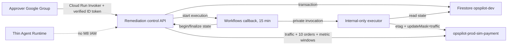

# M8 승인 기반 복구

[English](remediation.md) | **한국어**

상태: prod-sim target 배포 및 검증 완료; approval-gated

M8은 investigation API, Gemini Enterprise Runtime 또는 investigator identity에 승인·실행
권한을 부여하지 않습니다. Investigation API는 authenticated control bridge를 통해 적격한
`WAITING_APPROVAL` record 하나만 만들 수 있습니다. 실행 가능한 유일한 변경은
`opspilot-prod-sim-payment` traffic 100%를 captured faulty revision에서 captured known-good
revision으로 옮기는 것입니다.

## 신뢰 경계



Control API는 Google token issuer, fixed audience, verified email과 subject를 검증합니다.
Cloud Run IAM이 group membership을 강제하므로 application은 email 대신 SHA-256 actor
identifier만 저장합니다. Workflow callback URL은 TTL collection에만 저장하며 public API,
CLI, audit event 또는 log output으로 반환하지 않습니다.

## Public operation

```text
POST /api/v1/incidents/{incident_id}/remediations
GET  /api/v1/remediations/{remediation_id}
POST /api/v1/remediations/{remediation_id}/decision
```

Create·decision POST에는 `Idempotency-Key`가 필요합니다. 동일한 canonical request와 key를
반복하면 저장된 결과를 반환하고, 다른 payload에 재사용하면 409를 반환합니다. Plan-hash
또는 state conflict는 409, expired approval은 410, policy rejection은 422입니다. Project,
region, service, source/target revision, image digest, etag, URL과 token은 request field가
아닙니다.

Executor는 traffic만 재검증하고 변경합니다. Workflow는 bounded outcome을 control API에
반환하고, control API가 독립적으로 target traffic을 확인한 뒤 authenticated order를
정확히 10건 보내고 10분 Monitoring window를 auxiliary evidence로 기록하며 terminal state를
단독으로 씁니다.

## 로컬 계획과 평가

```powershell
uv run --extra agent opspilot scenario prepare --scenario SCN-008 --mode plan --auth gcloud
uv run --extra agent opspilot scenario reset --scenario SCN-008 --mode plan --auth gcloud
uv run --extra agent opspilot scenario abort --scenario SCN-008 --mode plan --auth gcloud
uv run opspilot remediation eval --suite remediation --format summary
uv run python scripts/m8_release.py preflight --output .tmp/m8-release
```

Plan 명령은 cloud call을 수행하지 않습니다. Execute mode에는 명시적인 cloud-change 승인과
environment-only project, immutable image, order URL, control URL 설정이 필요합니다. Payment
known-good image는 `OPSPILOT_SCN008_KNOWN_GOOD_IMAGE_URI`이며 Terraform의
`TF_VAR_remediation_image_uri`는 control/executor image 전용이므로 payment input으로
재사용하면 안 됩니다. CLI는 `gcloud auth print-identity-token`으로
`OPSPILOT_REMEDIATION_CONTROL_AUDIENCE`용 ID token을 얻고,
`OPSPILOT_REMEDIATION_URL`은 request base URL로만 사용합니다. Token 값은 입력하거나
출력하지 않습니다.

Request·decision 명령은 명시적 `--idempotency-key`를 받습니다. Network retry는 같은 값을
재사용하므로 응답을 잃어도 새 remediation이나 decision을 만들지 않습니다. Retry는 전체
deadline 안에서 transient 429/5xx/timeout/transport failure에 exponential full jitter를
적용해 최대 3회로 제한합니다. Non-transient 4xx와 idempotency key 없는 write는 즉시
실패합니다. `remediation show --format json`이 machine-readable polling contract입니다.

## 긴급 abort

`scenario prepare --mode execute`는 `.tmp/m8-release/recovery.json`에만 recovery record를
쓰고 faulty order를 보내기 전에 같은 trusted target을 Firestore에 저장합니다. Record에는
captured source/target revision, digest, etag와 bounded order count가 포함되며 Git이
무시합니다.

`scenario abort --mode execute`는 project, service, revision, digest, etag 또는 URL을
입력받지 않습니다. Firestore의 SCN-008 target을 불러오고 local recovery record가 함께
있다면 exact match를 요구합니다. 이후 fixed payment service, 두 revision digest,
Ready/serving state와 captured etag를 재검증합니다. 100% faulty serving revision만
known-good로 옮길 수 있고 이미 복구된 target은 idempotent success입니다. Traffic 복구 후
payment-failure template value도 제거합니다. Stale 또는 mismatched fact가 하나라도 있으면
update는 0건입니다.

Prepare는 20분 fault deadline을 기록하고 faulty-order, evidence 또는 report 작업이 실패·
취소되면 같은 guarded abort를 자동으로 시도합니다. Abort는 operational recovery이지 성공한
portfolio run이 아닙니다. Local record에 `abort_used=true`를 영구 표시하고 release
publisher는 해당 E2E를 거절합니다. Prepare/request/approval/verification 실패 또는 취소 시
즉시, 늦어도 fault 활성화 후 20분 안에 abort를 호출합니다.

## 배포 checkpoint

Terraform 기본값은 `enable_remediation=false`입니다. Activation plan은 additive M8
resource와 state-preserving payment resource move만 보여야 합니다. Versioned configuration
만으로 apply, faulty revision, approval, executor call 또는 reset이 승인되지는 않습니다.

Cloud checkpoint는 authentication negative smoke, approval 전 execution 0건, faulty order
10건, traffic update 1건, recovered order 10건, complete actor-hash event, reset, 최종
Terraform `No changes`를 순서대로 증명해야 합니다.

## 릴리스 gate

Release helper는 local 또는 read-only check만 수행하고 Docker push, Terraform apply,
scenario execute 또는 remediation decision command를 포함하지 않습니다.

```powershell
uv run python scripts/m8_release.py preflight --output .tmp/m8-release
uv run python scripts/m8_release.py verify --phase image --output .tmp/m8-release
uv run python scripts/m8_release.py verify --phase terraform-plan --output .tmp/m8-release
uv run python scripts/m8_release.py verify --phase post-apply --output .tmp/m8-release
uv run python scripts/m8_release.py verify --phase e2e --output .tmp/m8-release
uv run python scripts/m8_release.py publish --output .tmp/m8-release
```

Image phase는 operator environment의 `OPSPILOT_M8_LOCAL_IMAGE`와
`OPSPILOT_M8_REGISTRY_IMAGE_URI`를 읽습니다. Local tag는
`opspilot-m8:<full clean HEAD SHA>`, Registry 값은 immutable digest URI여야 합니다. 이
phase는 Registry digest, Linux/amd64, `65532:65532`, 두 health endpoint를 다시 확인하고
temporary container를 항상 제거하며 정제된 image fact만 `.tmp/m8-release/image.json`에
저장합니다. Container에는 setting validation에 필요한 고정 합성 값만 전달하고 cloud
identifier, URL 또는 credential은 전달하지 않습니다.

Post-apply 검증 전에 reviewed plan JSON을 선택한 release output path에 저장합니다. Durable
verifier는 delete/replacement, M8 allowlist 밖의 변경, public invoker IAM과 approved digest에
결합되지 않은 remediation image를 거절합니다. 사람이 검토한 binary plan은 `.tmp`에
남으며 apply 가능한 유일한 plan입니다. Terraform-plan phase는 SHA-256과 release-context
hash를 기록하고 post-apply가 binary SHA를 다시 계산해 변경 시 실패합니다.

Gate 순서:

1. Clean implementation commit에서 preflight를 실행합니다. 전체 local release gate와
   remediation 12/12를 수행하고 hash된 `release-context.json` 하나를 씁니다.
2. Image-push 승인 후 Linux/amd64를 build하고 non-root control/executor health를 확인한 뒤
   full-commit-SHA tag 하나를 push해 digest를 확정하고 image phase를 통과시킵니다.
3. Release context를 재검증하고 remote-state Terraform plan을 생성·검토합니다. Delete,
   replacement, out-of-scope resource, public IAM 또는 unapproved digest가 있으면 중단하고
   승인 후 검토한 binary plan만 apply합니다.
4. Post-apply는 Ready, internal executor ingress, named Firestore/TTL, active Workflow,
   no public invoker, Group control access, workflow-only executor invocation, unauthenticated
   denial, investigator denial과 external executor denial을 확인합니다.
5. 별도 fault 승인 후 prepare를 한 번 실행해 baseline 10/10, faulty 0/10, identified report,
   CHANGE-grounded `ACT-01`을 요구합니다.
6. Fixed request key로 remediation을 만들고 callback readiness를 기다립니다. Executor traffic
   update 0건을 확인하고 별도 approve decision 전에 plan hash/digest/expiry를 제시합니다.
7. 최대 5분 polling으로 `WAITING_APPROVAL -> APPROVED -> EXECUTING -> SUCCEEDED`, execution
   attempt/update 1건, target traffic 100%, verification 10/10을 요구합니다.
8. Reset 후 10/10, active Workflow 없음, Terraform `No changes`를 확인하고 E2E 검증과
   publish를 실행합니다.

서로 일치하는 clean preflight, image, post-apply, non-aborted E2E와 최종 zero-drift plan만
`docs/portfolio/results/remediation-release-v1.{json,md}`를 만들 수 있습니다. 게시 증빙은
control/executor와 payment known-good digest를 구분하고 aggregate action, check, order,
transition, hash-presence boolean과 safe failure code만 포함합니다. Project, region, Registry·
service URL, email, 실제 actor hash, revision, workflow, callback, remediation, execution,
request identifier는 제외합니다.
