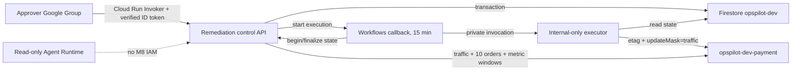

# M8 Approval-Gated Remediation

Status: implemented locally; cloud deployment and SCN-008 activation require separate approval

M8 does not add any write capability to `opspilot.api`, the Gemini Enterprise Runtime, or the
investigator identity. The only supported change is moving 100 percent of traffic on
`opspilot-dev-payment` from a captured faulty revision to a captured known-good revision.

## Trust boundaries



The control API validates the Google token issuer, fixed audience, verified email, and subject.
Cloud Run IAM enforces group membership, so the application stores only a SHA-256 actor identifier,
not an email address. The Workflow callback URL is stored only in the TTL collection and is never
returned by public API, CLI, audit event, or log output.

## Public operations

```text
POST /api/v1/incidents/{incident_id}/remediations
GET  /api/v1/remediations/{remediation_id}
POST /api/v1/remediations/{remediation_id}/decision
```

Creation and decision POSTs require `Idempotency-Key`. A repeated key with an identical canonical
request returns the stored result. Reusing it with another payload returns 409. Plan-hash or state
conflicts return 409, expired approval returns 410, and policy rejection returns 422. Project,
region, service, source revision, target revision, image digest, etag, URL, and token are not request
fields.

The executor only revalidates and changes traffic. The Workflow returns that bounded outcome to the
control API, which independently confirms target traffic, sends exactly ten authenticated orders,
records 10-minute Monitoring windows as auxiliary evidence, and alone writes the terminal state.

## Local planning and evaluation

```powershell
uv run --extra agent opspilot scenario prepare --scenario SCN-008 --mode plan --auth gcloud
uv run --extra agent opspilot scenario reset --scenario SCN-008 --mode plan --auth gcloud
uv run opspilot remediation eval --suite remediation --format summary
```

The plan commands perform no cloud call. Execute mode requires explicit cloud-change approval and
environment-only project, immutable image, order URL, and control URL configuration. The CLI obtains
an ID token for `OPSPILOT_REMEDIATION_CONTROL_AUDIENCE` from
`gcloud auth print-identity-token`; `OPSPILOT_REMEDIATION_URL` is only the request base URL. It
accepts and prints no token value.

## Deployment checkpoint

`enable_remediation=false` is the Terraform default. A reviewed activation plan must show only
additive M8 resources plus the state-preserving payment resource move. No apply, faulty revision,
approval, executor call, or reset is authorized by the committed configuration alone.

The cloud checkpoint must prove, in order: authentication negative smoke, zero execution before
approval, ten faulty orders, one traffic update, ten recovered orders, complete actor-hash events,
reset, and a final Terraform `No changes` plan.
