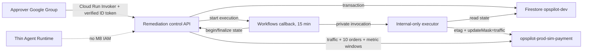

# M8 Approval-Gated Remediation

**English** | [한국어](remediation.ko.md)

Status: prod-sim target deployed and verified; approval-gated

M8 grants no approval or execution capability to the investigation API, Gemini Enterprise Runtime,
or investigator identity. The investigation API may create one eligible `WAITING_APPROVAL` record
through its authenticated control bridge. The only executable change is moving 100 percent of
traffic on `opspilot-prod-sim-payment` from a captured faulty revision to a captured known-good
revision.

## Trust boundaries



The control API validates the Google token issuer, fixed audience, verified email, and subject.
Cloud Run IAM enforces group membership, so the application stores only a SHA-256 actor identifier,
not an email address. The Workflow callback URL is stored only in the TTL collection and is never
returned by public API, CLI, audit event, or log output.

## Public operations

```text
POST /api/v1/incidents/{incident_id}/remediations
GET  /api/v1/remediations/{remediation_id}
POST /api/v1/remediations/{remediation_id}/decision
```

Creation and decision POSTs require `Idempotency-Key`. A repeated key with an identical canonical
request returns the stored result. Reusing it with another payload returns 409. Plan-hash or state
conflicts return 409, expired approval returns 410, and policy rejection returns 422. Project,
region, service, source revision, target revision, image digest, etag, URL, and token are not request
fields.

The executor only revalidates and changes traffic. The Workflow returns that bounded outcome to the
control API, which independently confirms target traffic, sends exactly ten authenticated orders,
records 10-minute Monitoring windows as auxiliary evidence, and alone writes the terminal state.

## Local planning and evaluation

```powershell
uv run --extra agent opspilot scenario prepare --scenario SCN-008 --mode plan --auth gcloud
uv run --extra agent opspilot scenario reset --scenario SCN-008 --mode plan --auth gcloud
uv run --extra agent opspilot scenario abort --scenario SCN-008 --mode plan --auth gcloud
uv run opspilot remediation eval --suite remediation --format summary
uv run python scripts/m8_release.py preflight --output .tmp/m8-release
```

The plan commands perform no cloud call. Execute mode requires explicit cloud-change approval and
environment-only project, immutable image, order URL, and control URL configuration. The payment
known-good image is `OPSPILOT_SCN008_KNOWN_GOOD_IMAGE_URI`; Terraform's
`TF_VAR_remediation_image_uri` is reserved for the control/executor image and must never be reused
as the payment input. The CLI obtains
an ID token for `OPSPILOT_REMEDIATION_CONTROL_AUDIENCE` from
`gcloud auth print-identity-token`; `OPSPILOT_REMEDIATION_URL` is only the request base URL. It
accepts and prints no token value.

Request and decision commands accept an explicit `--idempotency-key`. Network retries reuse that
same value, allowing an operator to recover a lost response without creating another remediation
or decision. Retries are limited to three transient 429/5xx/timeout/transport attempts with
exponential full jitter and a total deadline; non-transient 4xx and writes without an idempotency
key fail immediately. `remediation show --format json` is the machine-readable polling contract.

## Emergency abort

`scenario prepare --mode execute` writes a recovery record only under
`.tmp/m8-release/recovery.json` and stores the same trusted target in Firestore before sending the
faulty orders. The record includes the captured source/target revisions, digest, etag, and bounded
order counts; it is ignored by Git.

`scenario abort --mode execute` accepts no project, service, revision, digest, etag, or URL. It
loads the Firestore SCN-008 target and requires an exact match with the local recovery record when
both exist. It then rechecks the fixed payment service, both revision digests, Ready/serving state,
and captured etag. Only a 100-percent faulty serving revision can be moved to the known-good
revision; an already recovered target is an idempotent success. The payment-failure template value
is removed after traffic recovery. Any stale or mismatched fact produces zero updates.

Prepare records a 20-minute fault deadline and automatically attempts the same guarded abort if
faulty-order, evidence, or report work fails or is cancelled. An abort is operational recovery, not
a successful portfolio run. It permanently marks the local
record `abort_used=true`, and the release publisher refuses that E2E. Invoke abort immediately on
prepare/request/approval/verification failure or cancellation, and no later than 20 minutes after
fault activation.

## Deployment checkpoint

`enable_remediation=false` is the Terraform default. A reviewed activation plan must show only
additive M8 resources plus the state-preserving payment resource move. No apply, faulty revision,
approval, executor call, or reset is authorized by the committed configuration alone.

The cloud checkpoint must prove, in order: authentication negative smoke, zero execution before
approval, ten faulty orders, one traffic update, ten recovered orders, complete actor-hash events,
reset, and a final Terraform `No changes` plan.

## Release gates

The release helper performs only local or read-only checks. It contains no Docker push, Terraform
apply, scenario execute, or remediation decision command.

```powershell
uv run python scripts/m8_release.py preflight --output .tmp/m8-release
uv run python scripts/m8_release.py verify --phase image --output .tmp/m8-release
uv run python scripts/m8_release.py verify --phase terraform-plan --output .tmp/m8-release
uv run python scripts/m8_release.py verify --phase post-apply --output .tmp/m8-release
uv run python scripts/m8_release.py verify --phase e2e --output .tmp/m8-release
uv run python scripts/m8_release.py publish --output .tmp/m8-release
```

The image phase reads `OPSPILOT_M8_LOCAL_IMAGE` and `OPSPILOT_M8_REGISTRY_IMAGE_URI` from the
operator environment. The local tag must be `opspilot-m8:<full clean HEAD SHA>` and the Registry
value must be an immutable digest URI. The phase rechecks the Registry digest, Linux/amd64,
`65532:65532`, and both health endpoints, always removes its temporary containers, and stores only
sanitized image facts in `.tmp/m8-release/image.json`. The local containers receive only fixed
synthetic configuration values needed for settings validation; no cloud identifier, URL, or
credential is passed to them.

Before post-apply verification, save the reviewed plan JSON at the selected release output path.
The durable verifier rejects delete/replacement, changes outside the M8 resource allowlist, public
invoker IAM, and any remediation image not bound to the approved digest. The human-reviewed binary
plan remains under `.tmp` and is the only plan eligible for apply. The Terraform-plan phase records
its SHA-256 and the release-context hash; post-apply recalculates the binary SHA and fails on any
change.

Gate order:

1. Run preflight from a clean implementation commit. It runs the complete local release gate and
   remediation 12/12, then writes one hashed `release-context.json`. Tool, account, project, Docker,
   and scenario-plan checks are performed only by the phases that actually consume them.
2. After image-push approval, build Linux/amd64, verify non-root control/executor health, push one
   full-commit-SHA tag, resolve its digest, and pass the image phase before injecting only the
   digest URI.
3. Recheck the release context, generate and review the remote-state Terraform plan, and stop on a
   delete/replacement, out-of-scope resource, public IAM, or unapproved digest. Apply only that
   reviewed binary plan after approval.
4. Post-apply verification checks Ready state, internal executor ingress, named Firestore/TTL,
   active Workflow, no public invoker, Group control access, workflow-only executor invocation,
   unauthenticated denial, investigator denial, and external executor denial.
5. After a separate fault approval, execute prepare once. Require baseline 10/10, faulty 0/10,
   identified report, and CHANGE-grounded `ACT-01`.
6. Create a remediation with a fixed request key. Wait for callback readiness, verify zero executor
   traffic updates, and present the plan hash/digest/expiry before the separate approve decision.
7. Poll for at most five minutes. Require `WAITING_APPROVAL -> APPROVED -> EXECUTING -> SUCCEEDED`,
   one execution attempt/update, target traffic 100 percent, and verification 10/10.
8. Execute reset, require another 10/10, no active Workflow, and Terraform `No changes`; then run
   E2E verification and publish.

Only aligned clean preflight, image, post-apply, and non-aborted E2E phases plus a final zero-drift
plan may create `docs/portfolio/results/remediation-release-v1.{json,md}`. Published evidence keeps
control/executor and payment known-good digests separate and contains aggregate actions, checks,
orders, transitions, hash-presence booleans, and safe failure codes only. It excludes project,
region, Registry and service URLs, emails, actual actor hashes, revision, workflow, callback,
remediation, execution, and request identifiers.
