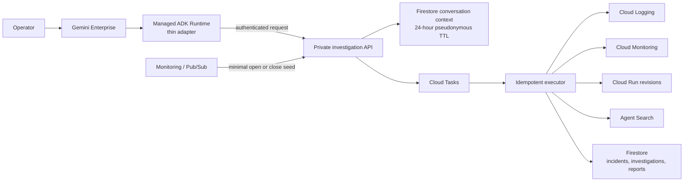
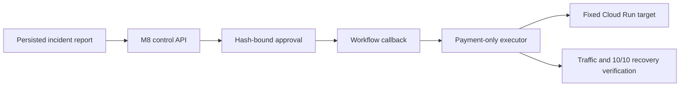

# OpsPilot 정식 에이전트 아키텍처

[English](architecture.md) | **한국어**

상태: 배포 및 Gemini Enterprise Preview 검증 완료

## 조사 plane

Parser는 `order-service`, `payment-service`, `inventory-service`와 한국어·영어 상대 또는
절대 1~120분 구간을 처리합니다. Service를 생략하면 3개 전체, 시간 구간을 생략하면
30분을 사용합니다. Incident ID는 최대 하나만 추출하고 합성 `dev`, `staging`,
`prod-sim` 환경을 지원하며, 실제 production은 명시적으로 거절합니다. 생략된 범위의
가정은 보고서에 기록합니다. Project ID, resource name, URL, metric과 provider raw filter는
항상 서버 정책이 생성합니다.

v2 turn API는 조사, 범위 조정, 설명, 상태, 보고서 비교, 기능 안내와 적격 remediation
요청 intent를 판정하고 가명화된 구조적 대화 문맥을 24시간 보관합니다. 문맥에는 원문
질문, 사용자·세션 식별자 또는 evidence 본문이 아닌 범위 참조만 저장합니다.

보고서는 immutable Firestore document입니다. Transaction이 단조 증가하는
`report_version`을 할당하고, replay는 영속 incident scope로 새 버전을 만들며 compare는
두 버전의 차이를 결정론적으로 반환합니다. Runtime에서 생성한 run/correlation/trace
identity를 API와 task worker가 재사용하고, run ID는 하나의 investigation에 결정론적으로
매핑됩니다. Cloud Task redelivery는 investigation ID로 중복 제거합니다.

Live direct signal은 최대 2회의 model call로 제한된 RCA·검증 graph에 전달됩니다.
Signal이 없으면 model을 건너뛰고, model timeout·schema 오류·잘못된 citation은
evidence-backed inconclusive 보고서로 강등합니다. Recorded fixture graph는 live fallback이
아니라 결정론적 offline 품질 평가 surface로 유지합니다.

## Remediation plane

M8 plane은 읽기 전용 조사 권한과 분리되어 있습니다. 적격한
`prod-sim payment-service` Cloud Run rollback만 지원하며 approval, actor audit,
plan hash, expiry, idempotency, lease, etag/revision/image digest와 최종 traffic 검증을
보존합니다. 에이전트는 `WAITING_APPROVAL`만 생성할 수 있고 승인과 실행은 별도 control
plane에서만 수행합니다.

## 신뢰 경계

신뢰할 수 없는 질문, alert, log와 document는 validation, catalog allowlist, redaction,
size/time/cost limit을 통과합니다. Runtime은 API invoke 권한만 가지며 운영 evidence 조회와
Firestore 쓰기는 API identity가 담당합니다. Alert payload와 raw user/session identity는
저장하지 않습니다. Source-domain hash는 actor, session, query, run, trace audit를 연결하지만
authorization에는 사용하지 않습니다. Runtime과 tool log에는 고정된 structured field만
남기고 질문, raw identity, cloud project, URL, token, exception payload, log content와
evidence body는 기록하지 않습니다.
