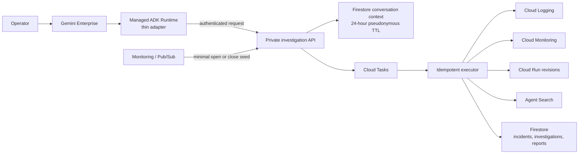
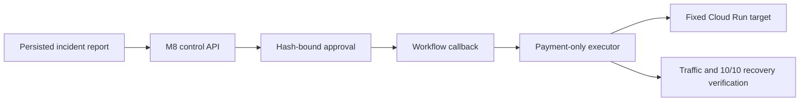

# OpsPilot Formal Agent Architecture

Status: deployed and Gemini Enterprise Preview verified

## Investigation plane

The parser accepts `order-service`, `payment-service`, and `inventory-service`, plus Korean or
English relative or explicit windows from 1 to 120 minutes. Omitted service scope means all three
services; an omitted window means 30 minutes. It extracts at most one incident ID and supports
synthetic `dev`, `staging`, and `prod-sim`; actual production remains explicitly rejected. Omitted
scope assumptions are recorded in the report.
Project IDs, resource names, URLs, metrics, and raw provider filters are always server-owned.

The v2 turn API owns intent and 24-hour structured conversation context for investigation,
refinement, explanation, status, report comparison, capability guidance, and eligible remediation
request creation. Context contains only pseudonymous scope references, never raw prompts,
user/session identifiers, or evidence bodies.

Reports are immutable Firestore documents. A transaction assigns a monotonically increasing
`report_version`; replay uses the persisted incident scope and compare deterministically reports
changes between two versions. Runtime creates one run/correlation/trace identity, the API and task
worker reuse it, and the run ID deterministically maps to one investigation. Cloud Task redelivery
is deduplicated by investigation ID.

Direct live signals enter the bounded RCA and verification graph with at most two model calls.
No-signal requests skip the model, and model timeout, schema failure, or invalid citations degrade
to an evidence-backed inconclusive report. The recorded fixture graph remains the deterministic
offline quality surface rather than a fallback for live evidence.

## Remediation plane

The M8 plane is isolated from the read-only investigator. It supports only an eligible
`prod-sim payment-service` Cloud Run rollback and retains approval, actor audit, plan hash, expiry,
idempotency, lease, etag/revision/image digest, and final traffic verification. The agent may create
`WAITING_APPROVAL`; approval and execution remain in the separate control plane.

## Trust boundary

Untrusted questions, alerts, logs, and documents pass through validation, catalog allowlists,
redaction, and size/time/cost limits. Runtime has API invoke permission only; operational reads and
Firestore writes belong to the API identity. Alert payloads and raw user/session identities are
not stored. Source-domain hashes link actor, session, query, run, and trace audit without acting as
authorization. Runtime and tool logs contain only fixed structured fields, never the question,
raw identity, cloud project, URL, token, exception payload, log content, or evidence body.
