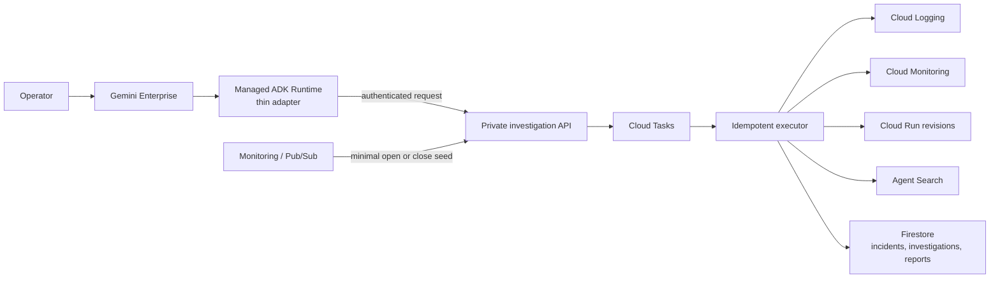
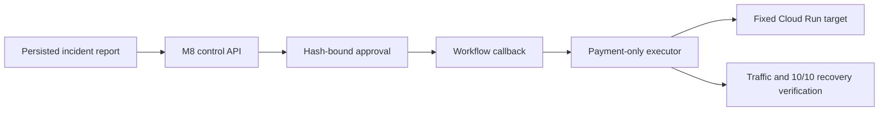

# OpsPilot MVP Architecture

Status: MVP complete / M9 ready

## Investigation plane

The parser accepts `order-service`, `payment-service`, and `inventory-service`, plus Korean or
English relative windows from 1 to 120 minutes. Omitted service scope means all three services;
an omitted window means 30 minutes. Those assumptions are recorded in the report. Project IDs,
resource names, URLs, metrics, and raw provider filters are always server-owned.

Reports are immutable Firestore documents. A transaction assigns a monotonically increasing
`report_version`; replay uses the persisted incident scope and compare deterministically reports
changes between two versions. Cloud Task redelivery is deduplicated by investigation ID.

The fixture graph and its two-model evaluation remain an offline quality surface. They do not
provide a production fallback for the Runtime.

## Remediation plane

The M8 plane is isolated from the read-only investigator. It supports only the fixed SCN-008
Cloud Run rollback and retains approval, actor audit, plan hash, expiry, idempotency, lease,
etag/revision/image digest, and final traffic verification.

## Trust boundary

Untrusted questions, alerts, logs, and documents pass through validation, catalog allowlists,
redaction, and size/time/cost limits. Runtime has API invoke permission only; operational reads and
Firestore writes belong to the API identity. Alert payloads and user identities are not stored.
Runtime logs contain an anonymous run ID, stage, elapsed time, and outcome, never the question,
user/session identity, cloud project, exception payload, or evidence body.
