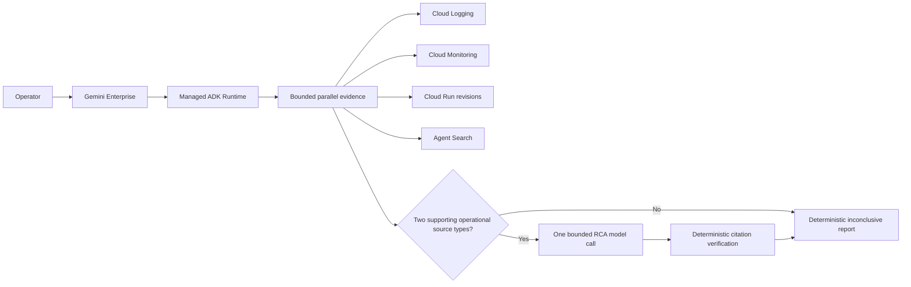
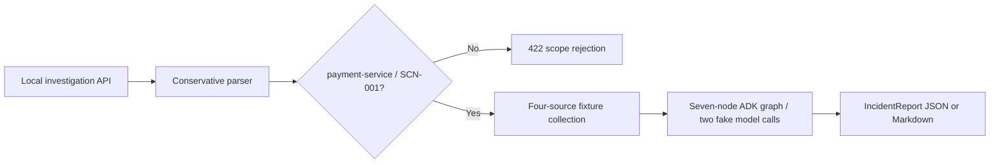
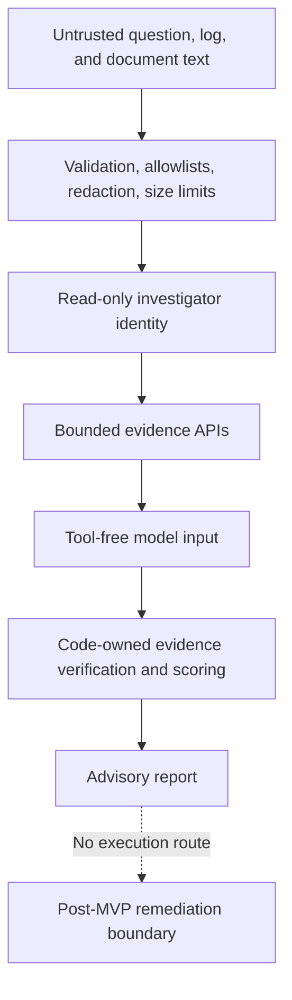

# OpsPilot Lean MVP Architecture

Status: Lean MVP v1

## Product surfaces

The local API is a separate fixture surface. It accepts only `payment-service` and executes
SCN-001; unsupported services and incident IDs return 422 instead of receiving a misleading
payment report.

## Trust boundary

Runtime logs contain an anonymous `run_id`, stage, elapsed time, source status/error codes, and
reasoning outcome. They do not contain the question, user/session identity, cloud project, raw
exception, or evidence payload.
